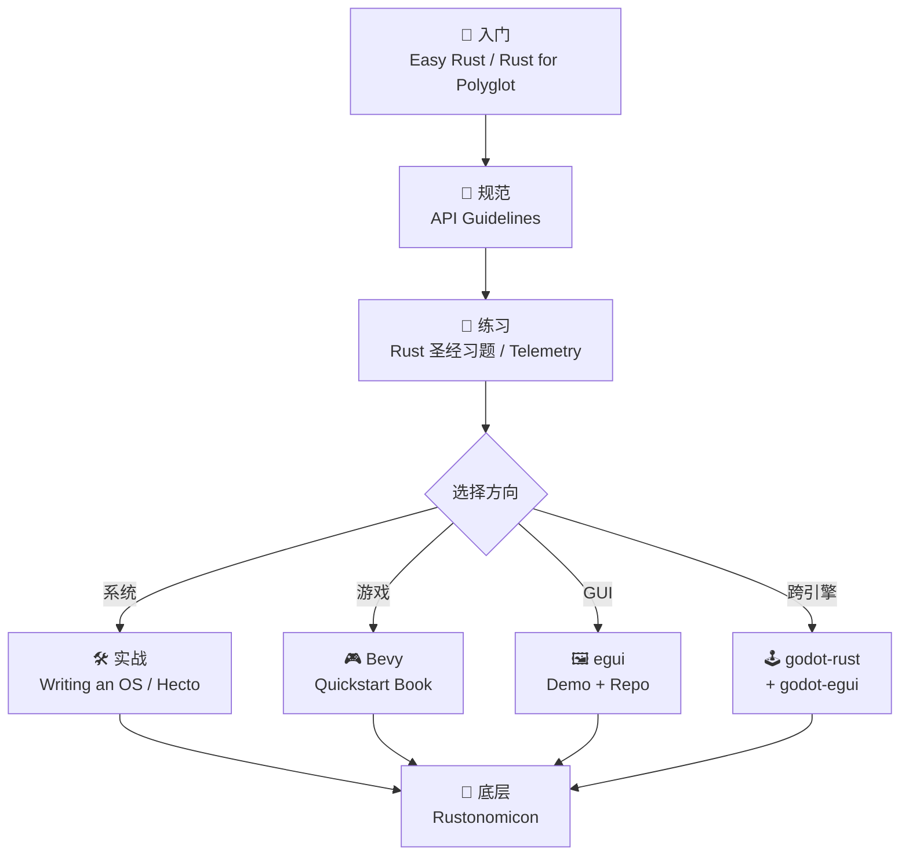

# 🦀 Rust 学习导航

> [!abstract] 总览
> 收录 18 个高质量 Rust 学习资源，覆盖**入门、进阶、底层、实战、游戏、GUI** 六大方向。
> 推荐学习路径：**入门教程 → API 规范 → 进阶练习 → 项目实战 → 领域专项**

---

## 📑 目录

- [[#🌱 一、入门教程|一、入门教程]]
- [[#📘 二、官方规范与底层|二、官方规范与底层]]
- [[#💪 三、进阶练习|三、进阶练习]]
- [[#🛠 四、项目实战|四、项目实战]]
- [[#🎮 五、游戏开发 - Bevy|五、游戏开发 - Bevy]]
- [[#🖼 六、GUI - egui|六、GUI - egui]]
- [[#🕹 七、游戏引擎 - Godot + Rust|七、游戏引擎 - Godot + Rust]]
- [[#🗺 推荐学习路线|推荐学习路线]]

---

## 🌱 一、入门教程

> [!tip] 适合人群
> 零基础或刚接触 Rust，需要建立语言基础认知。

| 资源                                                         | 语言 | 特点                         |
| ------------------------------------------------------------ | ---- | ---------------------------- |
| [Easy Rust](https://dhghomon.github.io/easy_rust/Chapter_3.html) | 英文 | 简洁直白，适合快速过一遍语法 |
| [Rust for Polyglot Programmers](https://www.chiark.greenend.org.uk/~ianmdlvl/rust-polyglot/index.html) | 英文 | 面向有其他语言基础的程序员   |
| [Rust 学习资料汇总（周吉平）](https://www.yuque.com/zhoujiping/programming/rust-materials) | 中文 | 资料地图，可作为索引页       |

---

## 📘 二、官方规范与底层

> [!info] 官方权威资源
> 写出**地道（idiomatic）** Rust 代码必备。

- 🔗 [Rust API Guidelines（主页）](https://rust-lang.github.io/api-guidelines/) — 官方 API 设计规范
- 📄 [API Guidelines - Documentation](https://rust-lang.github.io/api-guidelines/documentation.html) — 文档书写规范
- 🔬 [The Rustonomicon - Vec 实现](https://doc.rust-lang.org/nomicon/vec/vec.html) — **unsafe Rust 圣经**，从零实现 Vec

> [!warning] Nomicon 阅读门槛
> 需要先理解所有权、生命周期、智能指针，再读 Nomicon。

---

## 💪 三、进阶练习

> [!example] 边练边学
> 通过题目巩固语法，是从「会读」到「会写」的关键一步。

- [Rust 语言圣经 - 练习题](https://rusty.course.rs/) — 中文社区最佳练习集
- [Rust Exercises - Telemetry](https://rust-exercises.com/telemetry/) — 真实场景下的可观测性练习

---

## 🛠 四、项目实战

> [!success] 高含金量项目
> 完成其中之一，可以说是**真正掌握了 Rust**。

> [!quote] Writing an OS in Rust
> [https://os.phil-opp.com/](https://os.phil-opp.com/)
> Phil Oppermann 的传奇博客系列，**用 Rust 从零写一个操作系统内核**。包含 bootloader、内存管理、异步任务等。

> [!quote] Hecto - Build Your Own Text Editor
> [https://www.flenker.blog/hecto/](https://www.flenker.blog/hecto/)
> 改编自 C 语言版 [kilo](https://github.com/antirez/kilo)，用 Rust 实现一个 ~1000 行的终端文本编辑器。

---

## 🎮 五、游戏开发 - Bevy

> [!note] Bevy Quickstart Book
> [Bevy](https://bevyengine.org/) 是 Rust 生态中最受欢迎的 ECS 游戏引擎。

按章节顺序：

1. 📖 [Welcome](https://thebevyflock.github.io/bevy-quickstart-book/welcome.html) — 欢迎页
2. 🚀 [1. Application](https://thebevyflock.github.io/bevy-quickstart-book/1-intro/application.html) — 应用结构
3. 🔄 [2. Updating](https://thebevyflock.github.io/bevy-quickstart-book/1-intro/updating.html) — 更新循环
4. 🧩 [3. Basics](https://thebevyflock.github.io/bevy-quickstart-book/2-basics/index.html) — ECS 基础

---

## 🖼 六、GUI - egui

> [!info] 即时模式 GUI
> egui 是用 Rust 写的 immediate-mode GUI 库，简洁、快速、跨平台。

- 💻 [egui GitHub 仓库](https://github.com/emilk/egui/tree/main) — 源码、示例、文档入口
- 🌐 [egui 在线 Demo](https://www.egui.rs/#demo) — 浏览器中体验所有控件

---

## 🕹 七、游戏引擎 - Godot + Rust

> [!tip] 把 Rust 作为 Godot 的脚本语言
> 适合想要 Godot 易用性 + Rust 性能的项目。

- 📚 [godot-rust Book - Builtins](https://godot-rust.github.io/book/godot-api/builtins.html) — godot-rust 内置类型
- 🔧 [godot-egui](https://github.com/setzer22/godot-egui) — 在 Godot 中嵌入 egui 界面

---

## 🗺 推荐学习路线

> [!todo] 我的学习清单
>
> - [ ] 通读 Easy Rust，建立语法直觉
> - [ ] 完成 Rust 圣经习题前 5 章
> - [ ] 阅读 API Guidelines 全文
> - [ ] 选一个实战项目（OS / Hecto / Bevy 三选一）跟做
> - [ ] 啃完 Rustonomicon 的 Vec 章节

---

%%
原始链接备份（按收录顺序）：

1. https://rust-lang.github.io/api-guidelines/documentation.html
2. https://rusty.course.rs/
3. https://rust-exercises.com/telemetry/
4. https://os.phil-opp.com/
5. https://www.flenker.blog/hecto/
6. https://www.yuque.com/zhoujiping/programming/rust-materials
7. https://thebevyflock.github.io/bevy-quickstart-book/welcome.html
8. https://thebevyflock.github.io/bevy-quickstart-book/1-intro/application.html
9. https://thebevyflock.github.io/bevy-quickstart-book/1-intro/updating.html
10. https://thebevyflock.github.io/bevy-quickstart-book/2-basics/index.html
11. https://github.com/emilk/egui/tree/main
12. https://www.egui.rs/#demo
13. https://github.com/setzer22/godot-egui
14. https://godot-rust.github.io/book/godot-api/builtins.html
15. https://rust-lang.github.io/api-guidelines/
16. https://www.chiark.greenend.org.uk/~ianmdlvl/rust-polyglot/index.html
17. https://dhghomon.github.io/easy_rust/Chapter_3.html
18. https://doc.rust-lang.org/nomicon/vec/vec.html
    %%